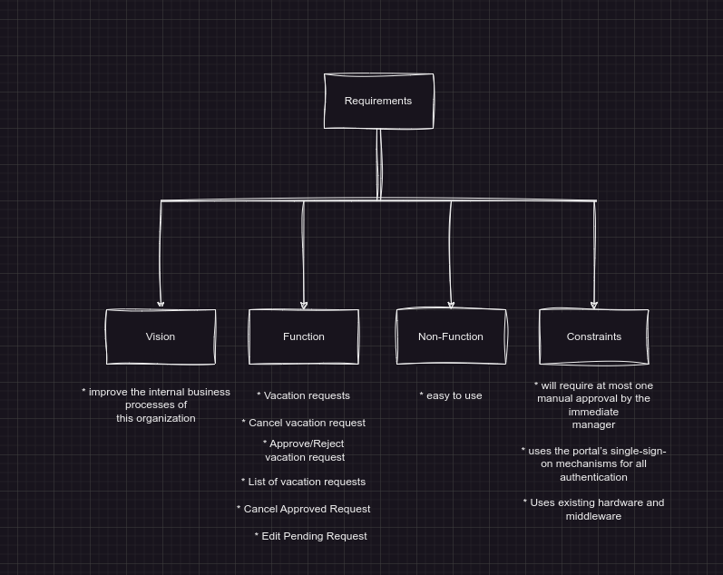
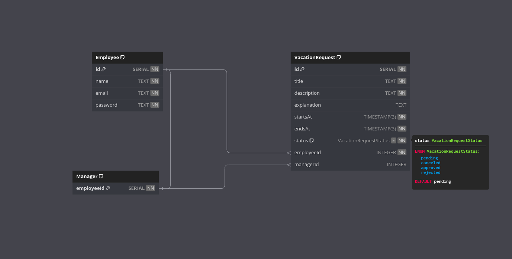
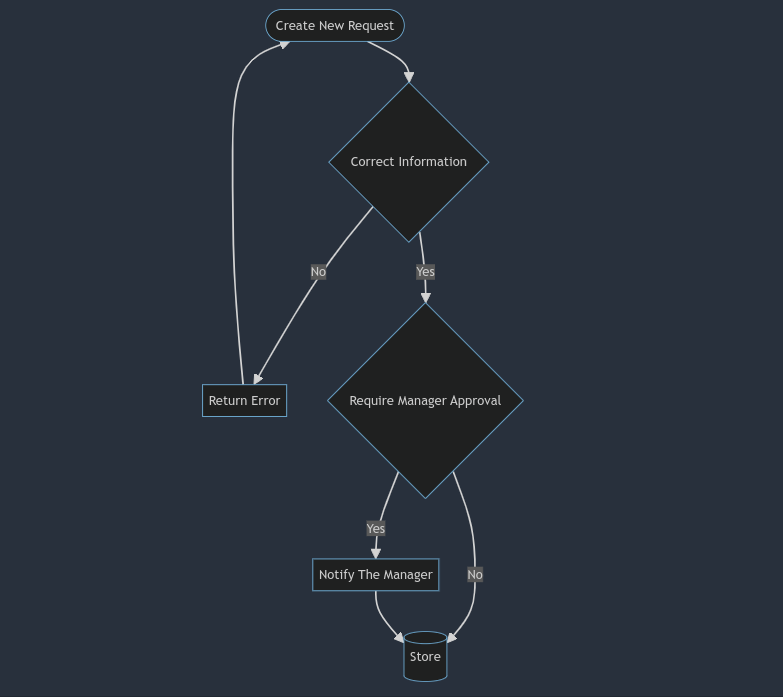
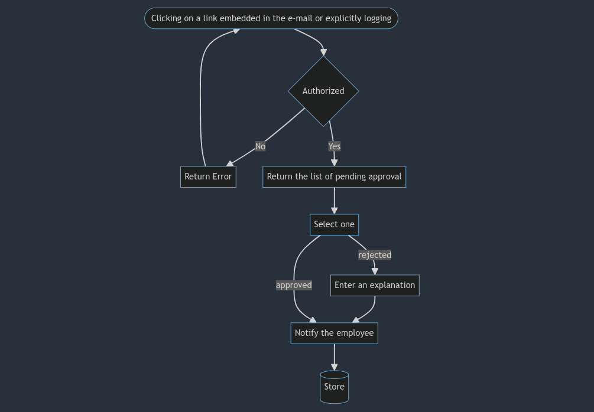
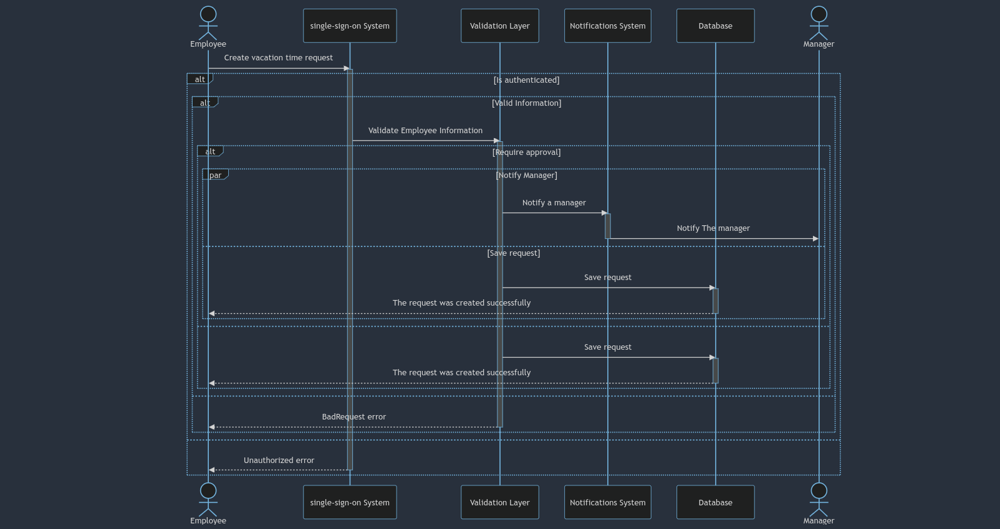
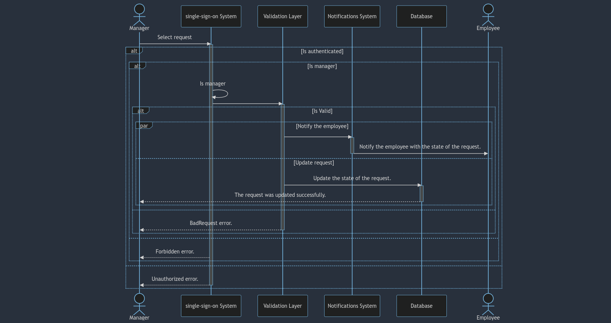

# Vacation Tracking System

## Requirements

    

## Domain [ Define Problem ]

**All vacation time had to be approved by an immediate manager and then checked by a clerk in the HR department before it was authorized. Sometimes this manual process could take days.**

## Actors

1. Employee: The main user of this system. An employee uses this system to manage his or her vacation time.

2. Manager: An employee who has all the abilities and goals of a regular employee, but with the added responsibility of approving vacation requests for immediate subordinates. A manager may award subordinates comp time, subject to certain limits set in the system.

3. Clerk: A member of the HR department who has sufficient rights to view employees’ personal data and is responsible for ensuring that employees’ information in all HR systems is up to date and correct. An HR clerk can add or remove nearly any record in the system. In the real world, HR clerks may or may not be employees; however, if they are employees, they use two separate login IDs to manage these two different roles.

4. System Admin: A role responsible for the smooth running of the system’s technical resources (e.g., Web server, database) and for collecting and archiving all log files.

## Use Case

- ### Manage Time
  - #### Entities (Data Model)
      

          
      

  - #### Flowchart [Flow]
    - ##### Create vacation request
        

          
        

    - ##### Response to vacation request
        

          
        

  - #### Sequence diagram
    - ##### Create vacation request
        

          
        

    - ##### Response to vacation request
        

          
        

  - #### Pseudocode
    - [Create vacation request](/create-request.pseudocode)
    - [Response to vacation request](/response.pseudocode)
